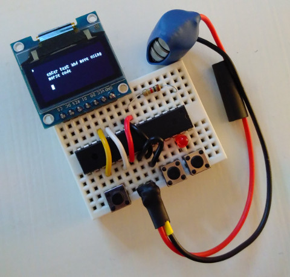

  [avrforth]: http://krue.net/avrforth/
  [ATmega328p]: https://en.wikipedia.org/wiki/ATmega328

# A solderless mini text editor for $4.50

Build a standalone [ATmega328p]-based text editor that is very simple
to wire up. Not so simple to use, perhaps. This project exists mainly
to educate myself on the innter workings of Forth, and Forth on the
AVR microcontrollers, and use in practice.

This is an [avrforth] adventure of mine. This is basically a fork of
[avrforth-2010.06.13](http://krue.net/avrforth/avrforth-2010.06.13.tar.gz),
but without the prior history because I couldn't find the official
source repo.



```
  ------
 | oled |
  ____________
 |            |
 |            |
 |   mcu      |
 |            |
 |_A______X_Y_|

```

## Parts

- [ATmega328p](https://www.aliexpress.com/item/ATMEGA328P-ATMEGA328P-PU-DIP-28-New-parts-best-price-and-short-lead-time/32824792718.html) $1.50
- [128x64 SD1306 0.96" OLED](https://www.aliexpress.com/item/0-96-White-0-96-Inch-OLED-Module-128X64-OLED-LCD-LED-Display-Module-For-Arduino/32847644906.html) $2.61
- [prototyping board](https://www.aliexpress.com/item/Solderless-Mini-Breadboard-size-3-5x4-5cm-Black-color/32804715393.html) $0.30
- [LED](https://www.aliexpress.com/item/Smart-Electronics-100pcs-lot-F3-3MM-Round-Red-Color-Highlight-Diffused-Round-DIP-Light-Emitting-Diode/32601503663.html) (100 pieces for $0.50)
- [3 push buttons](https://www.aliexpress.com/item/1x-Tactile-Push-Button-Switch-Momentary-Tact-6x6x4-3-mm-2-pin-DIP-Through-Hole/32639451079.html) $ 0.08 each
- One resistor to pull-up the RESET pin. Can be skipped for the brave
  hearted I think.
- Some short breadboard cables (I make my own with [this](https://www.sparkfun.com/products/11367)).

You will also need an AVR programmer that's capable of burning to the
bootsector (I use avrispmkII) and a serial connection to bootstrap the
code (I use Arduino). Getting this part set up is always such a
hassle :-(

## Building

- Update with your avrdude parameters in `makefile`
- Update your termianl parameters in `makefile`
- Update your chip model, usart and baud in `config.f`

```sh
$ make # produces ./flash and ./eeprom
$ make upload # burns these using avrdude
$ make serial # check that you have a prompt. exit with C-a C-q for good stty settings
$ make highlevel # sends blocks via serial, compiles avrforth code on-chip. watch for errors
# reset chip and cross your fingers
```

> AVRispmkii might not work while your OLED screen is connected
> because it doesn't like sharing the SPI connections for some reason.

> Make sure you have your right fuses set. Remember that Arduino uses
> an external crystal and our board does not. You have to program the
> chip fuses so that it uses its internal oscillator.

# Examples

The documentation for [avrforth] is rather scarse. Your best option is
probably to read the source code itself, which is luckily a pleasant
experience.

Below are some notes that I gathered while I was working on this.

### `$` ( -- x)

Read upcoming 16bit hex value. You'll need this in front of your
numerical input (except for some constants like `0` and `1`). See
`core.avrforth`.

### `mark`

This is an interesting one. All your colon definitions are immediately
compiled and written to flash because the chip doesn't really have
anywhere else to place your new instructions. These new definitions
are found in a lookup dictionary starting on the address of the `link`
pointer.

If you reset your AVR, the new `link` address is lost and you're back
to the dictionary since last `mark`. This can be very convenient when
your previous definitions were buggy.

`mark` will store your `link` from RAM into eeprom (`~link`). So
`mark` will persist your dictionary across resets.

```forth
> : test ] ;
: test ] ; ok
> ' test h. ( found! )
' test h. ( found! ) 2a42  ok
> empty
empty ok
> ' test h. ( gone )
' test h. ( gone ) 0000  ok
> : test ] ;
: test ] ; ok
> mark
mark ok
> empty
empty ok
> ' test h. ( survived )
' test h. ( survived ) 2a18  ok
```

### `empty`

Revert your `link` and friends to your last `mark`.

### `it`

This is a pointer to an eeprom variable that you can use to set the
startup procedure, aka turnkey.

    : start ." booting ..." ." done!" ] cr ] ;
    mark
    ' start it e!
    ( chip reset should now display "booting ...done!" )

## `if` (just checks the `z` flag)

    > : tst ( x -- x) ] 0? ] if ." nonzero " ] ; ] then ." zero " ] ;
    > $ 000 tst h.
    h.zero 0000  ok
    $ 001 tst h.
    nonzero 0001  ok

## `=if`

    > : equal? ( x1 x1 -- ) ] ?? ] drop ] drop ] =if ." yes " ] ; ] then ." no " ] ;
    ok
    > $ abba $ abba equal?
    yes  ok
    > $ abba $ beef equal?
    no ok

## `+!`

    > 2 var K
    2 var K ok
    > K @ h.
    K @ h. 3433  ok
    > 0 K ! h.
    0 K ! h. 0100  ok
    > K @ h.
    K @ h. 0000  ok
    > 1 K +! h.
    > $ abba 1 K +! h.
    $ abba 1 K +! h. abba  ok
    > K @ h.
    K @ h. 0002  ok
    > $ abba 4 K +! h.
    $ abba 4 K +! h. abba  ok
    > K @ h.
    K @ h. 0006  ok

## `word`

    > : echo" [ $ 22 l ] word ] type ] ;
    : echo" [ $ 22 l ] word ] type ] ; ok
    > $ beef echo" testing 123" h.

### `digit` ( c -- n )

`n` is ascii value of `c`

### `#` ( x -- x')

Print the uppermost hex digit of `x`. `x'` becomes digits shifted one
left. `h.` uses this internally.

    > $ 1234 # # # # 1234 ok

### `10*` ( x1 -- x2 )

`x2` is `x1` shifted left 1 hex digit.


### `task-queue`

[avrforth] offers an impressive multitasking feature that lets you run
your interactive shell alongside other jobs. The shell can stop and
redefine words used by other tasks on-the-fly (see `'btns.updater` for
how to do this).

```forth
( silly busy-waiting task )
: annoying ." annoying" ] cr [ $ ffff l ] for ] pause ] next ] annoying ] ;

( reserve RAM for task)
$ 40 var task.annoying

\ mytask $ 100 $ ff fill
\ mytask $ fff0 and $ 101 dump

' annoying $ 20 $ 20 task.annoying task-init ( set various return pointers etc in RAM )

task.annoying task-queue ( next pause will now take us to annoying )
( now watch it print while prompt is still alive )
( then do this: )
task.annoying task-dequeue ( to stop the annoying printouts )
```

# Troubleshooting

There is an ocean of things that can go wrong. Usually nothing will
tell you what that is though.

### `send.f` hangs

Make sure your serial is set up ok:

    for i in {{ 0 100 }} ; do echo test $i ; done > testlines
    ./send.f /dev/ttyUSB0 testlines

### Flashing is ok, but any colon-definition freezes the controller

Maybe the fuse bits are wrong? You need to set them so there's a big
bootloader. See `make fuse`.

### Serial port drops characters randomly

Are you sure only one program is using it the tty? Try:

    sudo lsof | grep /dev/ttyACM0 # or your equivalent

# License

Like [avrforth], this project is Public Domain.
